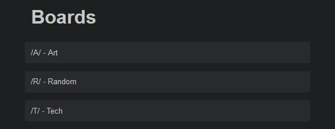
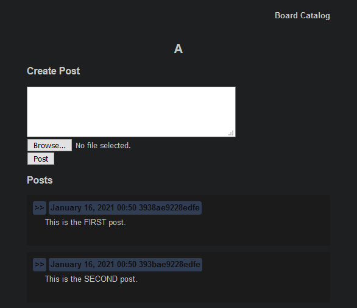
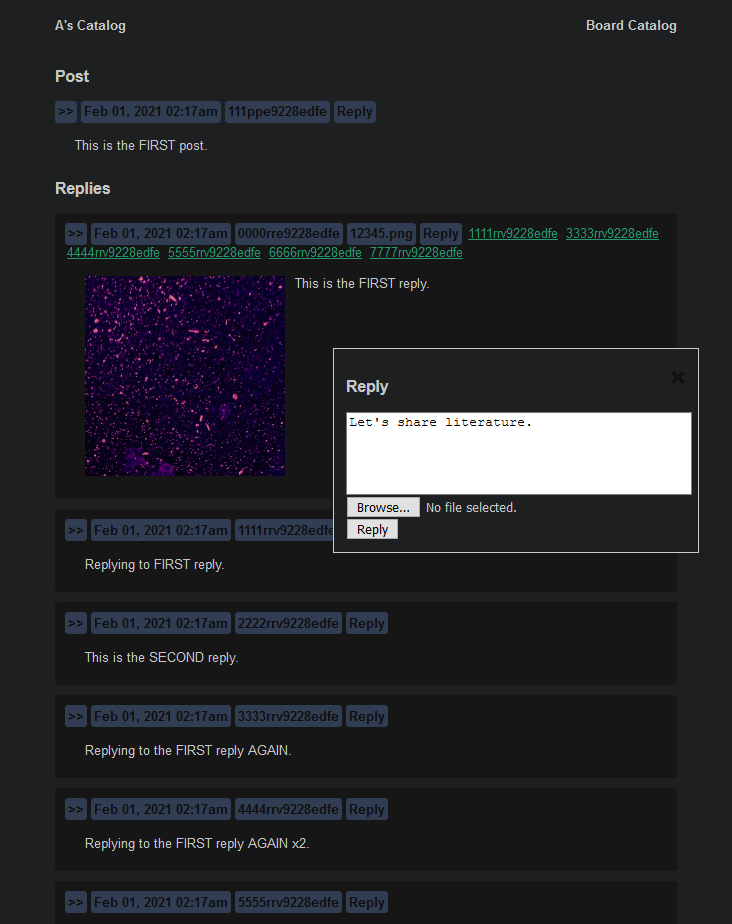

# Image Board

## Preview

> ## Boards
>Containers for different subjects.

 
 

>## Catalogs
>Preview all the posts on a board, or create a new one.

 
 

>## Posts
>Discuss the contents of a post.

## Getting Started

`pip install requirements.txt`

`cd app`

`py main.py`
